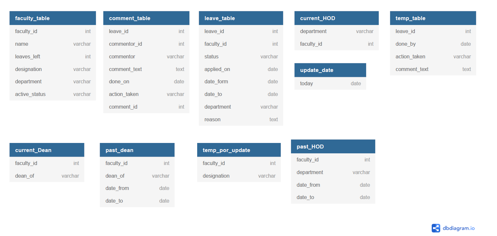

# Faculty Leave management and Profile Portal
This is a proper application developed for the Faculty leave management system and profile management system. The public profile of the faculty is based on NODEJS + MONGODB and the leave management part is based on NODEJS + POSTGRESQL.


## Dependencies
* NodeJS - For writing Backend Services
* Express 
* Passport - User Authentication
* Express-session - User session maintainence
* body-parser
* bcrypt - Encryption of Passwords of registered users
* mongoose - for the integration of MongoDB as a NoSQL database for the Public profile data-part
* pg - Used for the integration of POSTGRESQL as a SQL Database.

## Database Details
We used MongoDB as a NoSQL database in the project to store the Public profile of the user and PostgreSQL to store the details of Leave management system. The details of MongoDB can be understood from [this document](https://github.com/ASHU-web/faculty_leave_profile_portal/blob/main/MongoDB%20database%20Details.pdf) 

The details for Relational Database made on PostgreSQL are as follows:


Image is made using [dbdiagram.io](https://dbdiagram.io/home)

Please check [this link](https://github.com/ASHU-web/faculty_leave_profile_portal/blob/main/PostgreSQL%20database%20Details.pdf) for further information. 
Note: You can find the Triggers and functions related to the Relational database in the link mentioned above or you can also access it by [clicking here](https://github.com/ASHU-web/faculty_leave_profile_portal/blob/main/PostgreSQL%20database%20Details.pdf).

## Frontend Glimpses

CLI Image showong the data fetched from the PostgreSQL database and Only Encrypted password can be seen:

### Login Page:

### Home Page For public Profile Access:

### Logged In profile:


## Clone project via:
```bash
git clone https://github.com/ASHU-web/faculty_leave_profile_portal.git
```


## TEAM for the Project
* **Ashutosh Garg**  - [ASHU-web](https://github.com/ASHU-web) - [Homepage](https://ashu-web.github.io)
* **Ayush Agarwal**  -[ayushag-glitch](https://github.com/ayushag-glitch)

## Acknowledgments

* [Dr. Viswanath Gunturi](http://cse.iitrpr.ac.in/~gunturi/): for making us work on this in **Database Management Systems** course.

